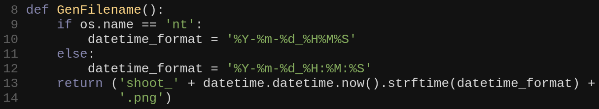

# Shoot

Shoot allows users to take screenshots of code in vim

**Example:**


**Output:**



## How to Use

Use the command `:TOpng` to capture a screenshot of the whole buffer

You can also call it with a range on lines to specify which lines to include

The image will be saved in vim's current working directory.

## How to Install

### Requirements

- Vim compiled with python3 support (check this with `:echo has('python3')`)
- Chrome or Firefox installed (a browser based on either of these should work too)

### Plugin Install

There are 3 components to installing Shoot:
1. The plugin itself
1. Python dependencies (selenium and requests)
1. A WebDriver

#### Installation with vim-plug

Add the following to your vim-plug plugin list in your .vimrc:
```
Plug 'jmckiern/vim-shoot', { 'do': '\"./install.py\"' }
```

And then outside the plugin list add this:
```
" This determines which WebDriver to use. Allowed options are 'chromedriver' or 'geckodriver'.
" Use 'geckodriver' if you use Firefox.
" Use 'chromedriver' if you Chrome/Chromium.
let g:shoot_preferred_driver = 'chromedriver'

" This lets Shoot know that it's ok to install a WebDriver.
" It will be installed in the plugin directory.
let g:shoot_install_driver = v:true
```

With these settings, vim will install the python dependencies (in to the plugin
dir) using ./install.py. Additionally, if no WebDriver is found, Shoot will
install the driver specified in `g:shoot_preferred_driver` (also to the plugin dir).

#### Uninstall

Remove the `Plug 'jmckiern/vim-shoot` from your .vimrc and run `:PlugClean`

## Options

- `g:shoot_preferred_driver` can be set to either `'geckodriver'` or `'chromedriver'`.
- `g:shoot_force_preferred_driver` only use the driver specified in `g:shoot_preferred_driver`
- `g:shoot_install_driver`, if set to `v:true`, Shoot will install the selected driver if none is found
